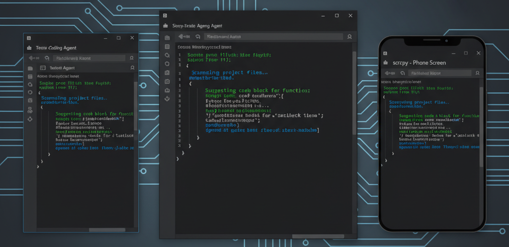

<p align="center">
  
</p>

# 0pty

Run your agents on a server instead of a local terminal. Reconnect to your active session after closing the terminal or restarting your computer. Connect from multiple devices at once --desktop, laptop, phone-- all in the same session.

0pty is a dependency-free Linux PTY persistence daemon/client pair for long-running interactive CLI programs: coding agents, shells, REPLs, debuggers, and anything else that expects a PTY. The server keeps a PTY alive, streams raw output, and replays recent output from a ring buffer when a client reconnects. The client is a byte pipe: stdin to the socket, socket to stdout.

---

## The Problem

Interactive CLI agents save conversations as JSON, but if the terminal crashes hard enough, the conversation does not always get written cleanly. `/resume` usually works. Sometimes it does not, and you lose hours of context, design decisions, and reasoning.

The fix: Run it inside a daemon on your dev machine that holds the PTY open permanently. Connect to it from whatever terminal you want. If the terminal crashes, the process doesn't. Reconnect, pick up where you left off. The conversation is never at risk because the process never died.

This isn't a terminal emulator. It's a PTY babysitter with a ring buffer and a TCP socket.

---

## Why 0pty?

`tmux` and `screen` are terminal multiplexers. They are broader tools with
terminal emulation, windows, panes, status bars, key bindings, and a long-lived
terminal UI. 0pty is narrower: it keeps one PTY-backed process alive and moves
raw bytes between that PTY and attached clients.

`dtach` is closer in spirit because it also avoids terminal multiplexing, but a
detached client misses output printed while it was away. 0pty keeps a bounded
server-side replay buffer, so reconnecting clients can catch up on recent output
before live output resumes.

---

## The Name

Zero point font renders nothing - 0pt + PTY. Pronounced "op-tee."

---

## Build

```sh
make
```

This builds:

- `bin/0pty`
- `bin/0pty-server`

The build uses `cc` by default, or `gcc`/another C11 compiler if you set `CC`. The server links `pthread` and `util`; the client links `pthread`.

`make test` builds both binaries and runs the protocol/ring-buffer regression test.

On Debian or Ubuntu, the usual build toolchain is enough:

```sh
sudo apt-get install build-essential
```

Install both binaries with:

```sh
make install PREFIX=/usr/local
```

Use `DESTDIR` for package staging, for example:

```sh
make install DESTDIR=/tmp/pkgroot PREFIX=/usr/local
```

You can also copy `bin/0pty` and `bin/0pty-server` to somewhere in your `$PATH`, or run them directly from the build directory.

## Supported Platforms

Linux is the supported target today for both `0pty-server` and `0pty`. CI runs
on Ubuntu. WSL2 should be treated as unverified Linux; native macOS and Windows
support is not implemented yet.

## Recommended Workflow

Start the agent directly, not a shell:

```sh
0pty claude01 start claude --resume
```

This means stop, restart, and crash recovery workflows can know what
command to run, what directory to use, and how to ask the agent to exit cleanly.

Avoid this for agent sessions:

```sh
0pty claude01 start bash
# then: claude --resume
```

That works for a persistent shell, but stop and restart become ambiguous because
0pty cannot know what is running inside the shell.

## Named Sessions

The easiest workflow is named sessions. `start` allocates a localhost port,
writes a session record under `~/.0pty/sessions`, launches `0pty-server`, and
attaches immediately.

```sh
# start persistent agent sessions in the current directory and attach
0pty claude01 start claude
0pty codexCoder start codex

# reattach later
0pty connect claude01
0pty connect codexCoder

# if there is exactly one alive session, this connects to it
0pty connect

# shorthand reattach
0pty claude01
0pty codexCoder

# list user sessions
0pty list

# restart a dead session from its stored cwd and argv
0pty restart codexCoder

# ask a live session to exit cleanly
0pty stop codexCoder
```

Commands are passed as normal argv, so extra flags work:

```sh
0pty copilot-sonnet start copilot --yolo
0pty connect copilot-sonnet
```

The conventional order also works:

```sh
0pty start codex01 -- codex
```

Session names can contain letters, digits, dots, dashes, and underscores.
Session listing is user-scoped: `0pty list` reads only `~/.0pty/sessions` for
the current user and checks liveness with a short TCP connect probe.
`0pty restart NAME` works only for dead sessions. It reuses the start-time
working directory and exact argv stored in the session file; it refuses to
replace an alive session.
`0pty stop NAME` sends the session's stored `graceful_input` to the live PTY
and waits for the server to shut down. The default graceful input is `/exit\n`.
Sessions that were already live before v0.2.0 need one `0pty restart NAME`
before `0pty stop NAME` works, because older session files do not have a
stored `control_token`.
Detaching does not require a command: close the terminal window running the
client, or leave it attached and open another client. The server process and
PTY stay alive until the program exits or you run `0pty stop NAME`.
When multiple clients are attached, the shared PTY follows the most recent
resize sent by any client.

For tools that use a different shutdown command, edit `graceful_input=` in
`~/.0pty/sessions/NAME.session`. The value supports `\n`, `\r`, `\t`, and `\\`
escapes; examples include `exit\n` for a shell and `quit()\n` for a Python REPL.

`start` also stores a per-session server log path under `~/.0pty/logs/NAME.log`.
That file is for `0pty-server` output and startup/restart diagnostics; it is not
a complete terminal transcript. Raw endpoint clients can write received PTY
output to a scrollback file with `0pty -l FILE host:port`.

## Raw Endpoint Mode

Default endpoints are `127.0.0.1:6077`.

Endpoint forms accepted by the shared parser:

- `host:port`
- `:port` for localhost on a different port
- `[ipv6][:port]`
- `host` for the default port

Typical workflow:

```sh
# on the dev box
bin/0pty-server -b 127.0.0.1:6077

# from another terminal or machine on the same network
bin/0pty 127.0.0.1:6077
```

To run a specific persistent command:

```sh
bin/0pty-server -b 127.0.0.1:6077 -- claude --resume
```

The server is meant to stay bound to localhost or a Tailscale interface. Do not expose it on `0.0.0.0`.

### Tailscale

Named sessions bind to localhost today. To reach a session directly from other
devices on your tailnet, use raw endpoint mode and bind `0pty-server` to your
Tailscale IP:

```sh
tailscale ip -4          # find your address
bin/0pty-server -b 100.x.y.z:6077 -- claude --resume
```

From any other Tailscale device:

```sh
bin/0pty 100.x.y.z:6077
```

Traffic is WireGuard-encrypted. See [examples/tailscale.md](examples/tailscale.md) for a full walkthrough including systemd setup.

### SSH

If you don't use Tailscale, keep the server bound to `127.0.0.1` on the remote machine and use SSH local port forwarding to bring the port to your laptop:

```sh
# on your laptop — forward local 6077 to localhost:6077 on the dev box
ssh -L 6077:127.0.0.1:6077 user@dev-box -N &

# then attach from your laptop as if the server were local
0pty connect claude01
# or raw:
bin/0pty 127.0.0.1:6077
```

The `-N` flag keeps the tunnel open without running a remote command. Close it with `kill %1` or `fg` + Ctrl-C when done.

For a persistent tunnel that reconnects automatically, add to your `~/.ssh/config`:

```
Host dev-box
    HostName your.server.example.com
    LocalForward 6077 127.0.0.1:6077
    ServerAliveInterval 30
    ExitOnForwardFailure yes
```

Then `ssh dev-box -N` (or with `autossh` for auto-reconnect) keeps the port available locally whenever you need it. See [examples/ssh.md](examples/ssh.md) for a full walkthrough.

## Protocol

Frames are length-prefixed. Each message is a 4-byte big-endian length, a 1-byte message type, and the payload.

The first client frame on a connection must be `HELLO`, `RECONNECT`, or
`CONTROL_SHUTDOWN`. Any other first frame gets an `ERROR` response and the
server closes the connection.

The current message set covers:

- `HELLO` / `RECONNECT`
- `WELCOME`
- `STDIN` / `STDOUT`
- `RESIZE`
- `ACK`
- `REPLAY`
- `ERROR`
- `CONTROL_SHUTDOWN`

Sequence numbers identify the server byte stream. The client remembers the last sequence it saw, sends that on reconnect, and the server replies with a replay frame followed by live output.

The ring buffer is **1 MB** by default. This is set at compile time via `OPTY_DEFAULT_RING_SIZE` in `src/protocol.h`.

## Security

The transport is not SSH. Bind only to `127.0.0.1` or a private/Tailscale
address and keep a shared attach token enabled for non-local use. The example
service file under `systemd/` defaults to localhost for that reason.

For raw endpoint mode on a private or Tailscale interface, set the same shared
token on the server and client:

```sh
export OPTY_TOKEN='choose-a-long-random-value'

# server
bin/0pty-server -b 100.x.y.z:6077 -t "$OPTY_TOKEN" -- claude --resume

# client
bin/0pty -t "$OPTY_TOKEN" 100.x.y.z:6077
```

The shared token is an application-level attach secret, not encryption. Use SSH
forwarding or Tailscale for transport security. Named sessions also store a
separate `control_token` used only for `0pty stop NAME`. The example
`systemd/0pty-server.service` leaves `OPTY_CONTROL_TOKEN` unset by default,
which disables `CONTROL_SHUTDOWN` requests until you provide one via
`EnvironmentFile=` or `-c`.

Named session files are user-scoped and stored under `~/.0pty/sessions` with
0600 permissions. The `control_token` in that file is the authority for
`0pty stop`; anyone who can read the session file can stop that user's session.

## Changelog

See [CHANGELOG.md](CHANGELOG.md) for the full release history.

## Reconnect Workflow

1. The server keeps the PTY and ring buffer alive even when no clients are attached.
2. The client disconnects and later reconnects with its last known sequence number.
3. The server replays buffered output starting at that sequence.
4. Live PTY output resumes immediately after replay.

That is the whole design: persistent process, raw byte stream, bounded replay buffer.
